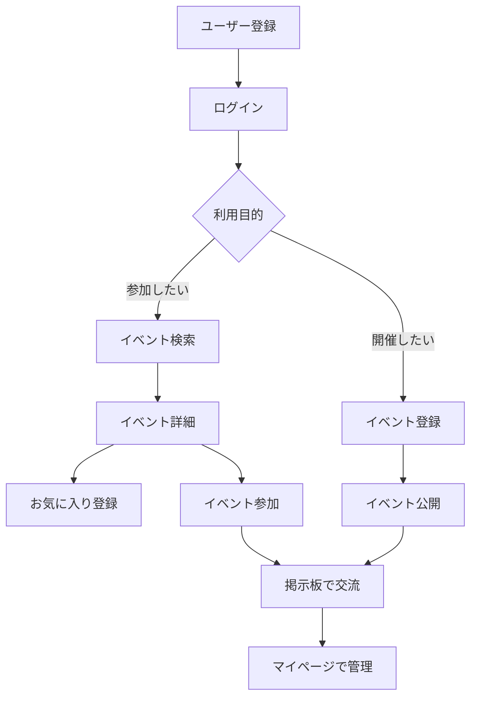
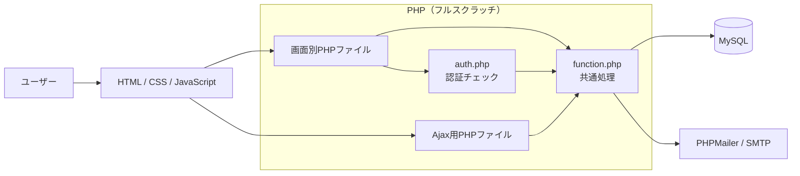

# KENYU（剣友）

KENYUは、剣道の交流会や自主練習会を気軽に開催・検索できるWebサービスです。

道場への継続的な所属に不安がある人、久しぶりに剣道を再開したい人、普段とは違う相手と稽古したい人が、単発でも参加しやすい場を見つけられることを目指しています。

- デモ: [KENYU（剣友）](https://yk-lab.jp/kenyu/)
- 開発記事（Qiita）: [Qiita記事はこちら](https://qiita.com/kaz_pro/items/ed33cd8526670c24beb0)
- リポジトリ: [i994114/KENYU](https://github.com/i994114/KENYU)
- テストユーザー: `akane@example.com`
- パスワード: `aaaa1111`

> [!NOTE]
> 初版では、イベントを「作成する・探す・参加する」というコア機能を優先しています。参加定員、募集状態、参加者一覧などは今後追加する予定です。

## 目次

- [主な機能](#主な機能)
- [利用の流れ](#利用の流れ)
- [使用技術](#使用技術)
- [システム構成](#システム構成)
- [主要ファイル](#主要ファイル)
- [データベース設計](#データベース設計)
- [ローカル環境のセットアップ](#ローカル環境のセットアップ)
- [実装上のポイント](#実装上のポイント)
- [セキュリティ](#セキュリティ)
- [既知の制約](#既知の制約)
- [ロードマップ](#ロードマップ)

## 主な機能

| 機能 | 概要 |
|---|---|
| ユーザー登録・認証 | 登録、ログイン、ログアウト、パスワード変更・再設定 |
| プロフィール | ユーザー情報とプロフィール画像の編集 |
| イベント管理 | イベントの登録、編集、論理削除 |
| イベント検索 | 開催日や地域などを使った検索、一覧・詳細表示 |
| イベント参加 | 参加登録・取消をAjaxで処理 |
| お気に入り | 登録・解除をAjaxで処理 |
| 掲示板 | イベント単位で複数ユーザーがメッセージを投稿 |
| マイページ | 主催、参加、お気に入り、新着メッセージを確認 |
| アカウント退会・復帰 | 論理削除と、条件を満たす再登録時のデータ復帰 |

## 利用の流れ



## 使用技術

| 分類 | 使用技術 |
|---|---|
| フロントエンド | HTML5 / CSS3 / JavaScript / jQuery 2.2.2 |
| 非同期通信 | Ajax |
| バックエンド | PHP 7.4.33 |
| データベース | MySQL |
| DBアクセス | PDO |
| メール送信 | PHPMailer 7 |
| 環境変数 | phpdotenv 5 |
| 開発環境 | MAMP |
| 公開環境 | Xserver |

> [!WARNING]
> PHP 7.4はサポートが終了しています。公開環境では、動作確認と互換性対応を行ったうえでPHP 8系へ移行してください。

## システム構成



MVCフレームワークは使用していません。画面ごとのPHPファイルがリクエストを受け取り、複数画面で使用する処理を`function.php`から呼び出します。

ログインが必要な画面では`auth.php`を読み込みます。お気に入りと参加処理は、`ajaxLike.php`と`ajaxParticipant.php`がAjaxリクエストを受け取ります。

## 主要ファイル

```text
KENYU
├── database/
│   ├── setup.sql              # DBセットアップの起点
│   ├── create_tables.sql      # テーブル作成
│   ├── drop_tables.sql        # 既存テーブル削除
│   ├── categories.sql         # カテゴリーマスタ
│   ├── prefectures.sql        # 都道府県マスタ
│   ├── targets.sql            # 対象者マスタ
│   └── seed.sql               # サンプルデータ
├── img/
├── js/
│   └── main.js                # Ajax・UI処理
├── function.php               # DB、検証、メール、画像などの共通処理
├── auth.php                   # セッションによる認証チェック
├── index.php                  # イベント一覧・検索
├── eventDetail.php            # イベント詳細
├── registEvent.php            # イベント登録・編集・削除
├── msg.php                    # イベント掲示板
├── mypage.php                 # マイページ
├── signup.php                 # ユーザー登録
├── login.php                  # ログイン
├── logout.php                 # ログアウト
├── profEdit.php               # プロフィール編集
├── passEdit.php               # パスワード変更
├── passRemindSend.php         # パスワード再設定メール送信
├── passRemindRecieve.php      # パスワード再設定
├── ajaxLike.php               # お気に入り登録・解除
├── ajaxParticipant.php        # イベント参加・取消
├── composer.json
├── .env.example
└── .htaccess
```

`passRemindRecieve.php`の`Recieve`は現在の実ファイル名です。一般的な英語表記は`Receive`ですが、参照先への影響を避けるため、変更時は呼び出し箇所も同時に更新してください。

## データベース設計

### テーブル一覧

| テーブル | 用途 |
|---|---|
| `users` | ユーザー情報、認証情報、論理削除状態 |
| `categories` | イベントカテゴリーのマスタ |
| `targets` | イベント対象者のマスタ |
| `prefectures` | 都道府県マスタ |
| `events` | イベント本体 |
| `event_targets` | イベントと対象者の中間テーブル |
| `event_participants` | イベントと参加者の中間テーブル |
| `boards` | イベント単位の掲示板 |
| `messages` | 掲示板の投稿 |
| `favorites` | ユーザーとお気に入りイベントの中間テーブル |
| `signup_logs` | 登録回数制限に使用するIPアドレスと登録日時 |

`event_targets`と`event_participants`は複合主キーを使用しています。`favorites`には`user_id`と`event_id`のユニーク制約があります。

`events.prefecture_id`は都道府県マスタのIDを保持しますが、現在の`create_tables.sql`では外部キー制約を設定していません。

### 削除方針

- ユーザー、主催イベント、所有する掲示板は`delete_flg`で論理削除します。
- 退会時の参加情報とお気に入りは物理削除します。
- イベント削除時の参加情報とお気に入りも物理削除します。
- 退会済みユーザーの復帰時は、主催イベントと所有する掲示板をトランザクション内で復帰させます。

> [!CAUTION]
> 現在の復帰処理は、ユーザー自身が退会前に削除していたイベントも含め、そのユーザーが主催したイベントをすべて復帰させます。復帰対象を区別するには、削除理由または削除日時などの追加情報が必要です。

## ローカル環境のセットアップ

### 1. 必要な環境

- Apache（`.htaccess`を利用できること）
- PHP 7.4互換環境
- MySQL
- Composer
- PHP拡張: PDO MySQL、mbstring、Exif、OpenSSL
- SMTPアカウント（パスワード再設定を利用する場合）

新規構築ではPHP 8系への移行を推奨します。ただし、現行コードの互換性を確認してから切り替えてください。

### 2. リポジトリを取得

```bash
git clone https://github.com/i994114/KENYU.git
cd KENYU
```

### 3. 依存パッケージをインストール

```bash
composer install
```

### 4. 環境変数を設定

`.env.example`を`.env`としてコピーし、環境に合わせて値を設定します。

```dotenv
APP_ENV=local
APP_DEBUG=false
APP_URL=http://localhost/KENYU

DB_HOST=localhost
DB_NAME=kenyu
DB_USER=your_db_user
DB_PASS=your_db_password

SMTP_HOST=your_smtp_host
SMTP_PORT=587
SMTP_USER=your_smtp_user
SMTP_PASS=your_smtp_password
SMTP_FROM=your_from_address

SESSION_SAVE_PATH=/var/tmp/
```

> [!IMPORTANT]
> `APP_URL`はパスワード再設定ページとログインページのURL生成に使用します。現在の`.env.example`には含まれていないため、`.env`へ追加してください。

`SESSION_SAVE_PATH`には、PHPを実行するユーザーが読み書きでき、Webから直接公開されないディレクトリを指定してください。

### 5. データベースを作成

MySQLにデータベースを作成した後、プロジェクトのルートからセットアップSQLを実行します。

```sql
CREATE DATABASE kenyu
  CHARACTER SET utf8mb4
  COLLATE utf8mb4_unicode_ci;
```

```bash
mysql -u your_db_user -p kenyu < database/setup.sql
```

`database/setup.sql`は、既存テーブルの削除、テーブル作成、マスターデータとサンプルデータの登録を順番に実行します。

> [!CAUTION]
> `setup.sql`は`drop_tables.sql`を最初に読み込むため、既存テーブルとデータを削除します。本番データベースには実行しないでください。

### 6. 画像保存先を準備

アップロード画像はプロジェクト直下の`uploads/`に保存されます。ディレクトリを作成し、PHPから書き込める権限を設定してください。

```bash
mkdir uploads
```

OSやWebサーバーの構成に合わせて、必要最小限の書込権限を設定してください。

### 7. Apacheの公開ディレクトリを設定

プロジェクトのルートをApacheから参照できるようにします。`.htaccess`では以下を設定しています。

- `top.php`を既定ページに指定
- `.env`などのドットファイルへのアクセスを禁止
- SQL、ログ、lock、JSONファイルへのアクセスを禁止
- ディレクトリ一覧表示を禁止

セットアップ後、設定したURLへアクセスしてトップページ、ログイン、検索、画像表示、メール送信を確認してください。

## 実装上のポイント

### PDOによる共通SQL実行

SQLの準備と実行は`function.php`の`queryPost()`に集約しています。

```php
function queryPost($dbh, $sql, $data) {
  $stmt = $dbh->prepare($sql);

  if (!$stmt->execute($data)) {
    debug('クエリに失敗しました');
    debug('失敗したクエリ：' . print_r($stmt,true));
    $err_msg['common'] = ERR_SYSTEM;
    return 0;
  } else {
    debug('クエリ成功');
    return $stmt;
  }
}
```

### イベント編集時の認可

イベント編集画面では、URLで指定されたイベントの投稿者とログイン中のユーザーを比較します。

```php
if (!empty($dbFormData)
    && (int)$dbFormData['user_id'] !== (int)$_SESSION['user_id']) {
  header('Location:mypage.php');
  exit();
}
```

### トランザクション

イベント登録では、イベント本体、掲示板、対象者情報を一つのトランザクションで登録します。退会処理、イベント削除、ユーザー復帰でもトランザクションを使用します。

```php
$dbh->beginTransaction();

try {
  // イベント、掲示板、対象者情報を登録
  // 途中の失敗時は例外を送出

  $dbh->commit();
} catch (Exception $e) {
  if ($dbh->inTransaction()) {
    $dbh->rollBack();
  }

  $err_msg['common'] = ERR_SYSTEM;
}
```

### 画像アップロード

拡張子だけでなく、`exif_imagetype()`を使って画像の実体を検証します。GIF、PNG、JPEGだけを許可し、ファイル内容のSHA-1ハッシュを保存名に使用します。

```php
$type = @exif_imagetype($file['tmp_name']);

if (!in_array($type, [
  IMAGETYPE_GIF,
  IMAGETYPE_PNG,
  IMAGETYPE_JPEG,
], true)) {
  throw new RuntimeException('画像ファイルが不正です');
}

$path = 'uploads/'
      . sha1_file($file['tmp_name'])
      . image_type_to_extension($type);

if (!move_uploaded_file($file['tmp_name'], $path)) {
  throw new RuntimeException('ファイル保存時にエラーが発生しました');
}
```

## セキュリティ

### 実装済み

- PDOのプリペアドステートメント
- `htmlspecialchars()`によるHTML出力時のエスケープ
- `password_hash()`と`password_verify()`によるパスワード管理
- サーバー側でのイベント投稿者チェック
- ユーザー登録、掲示板投稿、Ajax操作の連続実行制限
- 画像実体の検証
- パスワード再設定コードの有効期限確認
- `.htaccess`による設定・開発ファイルの公開制限

### 未実装・改善予定

- CSRFトークンの発行と検証
- セッションCookieの`Secure`、`HttpOnly`、`SameSite`設定
- ログイン成功時に限定したセッションID再生成
- 機密情報をデバッグログへ渡さない実装
- PHP 8系への移行
- 自動テストと依存パッケージの継続的な脆弱性確認

> [!WARNING]
> デバッグ有効時には、セッション内容、パスワード再設定コード、再発行パスワードなどがログへ渡されます。本番環境では必ず`APP_DEBUG=false`にし、`php.log`をWebから参照できないことを確認してください。将来的には、設定にかかわらず機密情報をログへ渡さない実装へ変更します。

## 既知の制約

- イベントの定員と現在の参加人数を管理していません。
- 募集中、定員到達、募集終了、開催終了を区別していません。
- 主催者プロフィールと参加者一覧の専用画面はありません。
- Ajax処理は更新後の状態をJSONで返しません。
- Ajaxを含む状態変更リクエストにCSRF検証がありません。
- `events.prefecture_id`に外部キー制約がありません。
- ユーザー復帰時に、本人が以前削除した主催イベントも復帰します。
- PHPUnitなどによる自動テストは未導入です。

## ロードマップ

1. PHP 8系への移行、CSRF対策、セッション・ログ設定の強化
2. イベント定員、現在参加数、定員到達時の参加制限
3. 募集中、募集終了、開催終了の状態管理
4. 主催者プロフィール、参加者一覧、ユーザー詳細ページ
5. AjaxレスポンスのJSON化とエラー表示
6. PHPUnitによる自動テスト
7. 管理者機能、通知、レビュー、地図連携、検索条件の拡充

## ライセンス

現時点でリポジトリにライセンスファイルはありません。第三者による利用・改変・再配布の条件を明確にする場合は、用途に合った`LICENSE`を追加してください。
